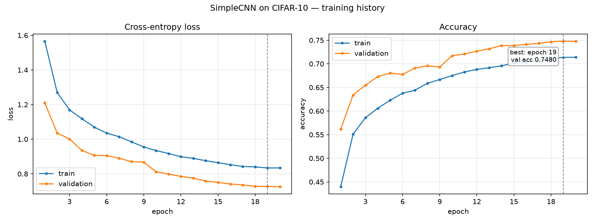
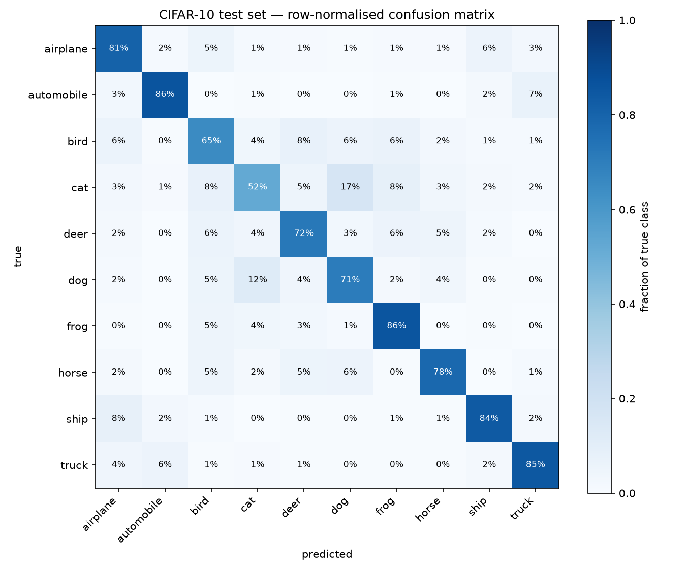

# CIFAR-10 Simple CNN

A deliberately simple convolutional network — exactly two convolutional layers — trained on CIFAR-10 and built as a complete end-to-end pipeline: data preparation, training with validation-based model selection, single-pass test evaluation, and cold-load inference from a saved checkpoint. The two-layer limit is an assessment constraint, not a modelling choice; it is held throughout even where more depth would clearly help, and the analysis below quantifies what that constraint costs.

## Results

| Metric | Value |
|---|---|
| Parameters | 60,554 |
| Best validation accuracy | 74.80% (epoch 19 of 20) |
| Test accuracy | 75.87% |
| Test loss | 0.7177 |
| Training time | 20.1 min on CPU (~60 s/epoch) |



Loss and accuracy per epoch; the dashed line marks epoch 19, the checkpoint selected on validation accuracy and the one evaluated on the test set.



Row-normalised confusion matrix on the 10,000-image test set: each row shows where the true class was actually sent.

**Underfitting, not overfitting.** Final train accuracy (71.4%, measured with dropout and augmentation active and averaged over the epoch) sits *below* validation accuracy (74.8%), and stays below it for the whole run. Both curves are still descending at epoch 20. The binding constraint is capacity, not regularisation.

**Vehicles versus animals.** Vehicle classes (airplane, automobile, ship, truck) average 83.8% recall; animal classes (bird, cat, deer, dog, frog, horse) average 70.6%. Rigid objects with consistent silhouettes are separable with two conv layers. Deformable animals, which vary by pose, occlusion and viewpoint, need deeper part-level features that this architecture cannot build.

**Cat is the weakest class** at 52.0% recall, more than 12 points below the next worst. The dominant errors are cat→dog (166 images) and dog→cat (124). Cat precision (0.64) exceeds cat recall (0.52), meaning the model under-predicts cat: when it commits to cat it is usually right, but it frequently declines to.

**Calibration is usable.** Mean confidence is 0.787 on correct predictions versus 0.545 on incorrect ones. The separation is wide enough that a confidence threshold is a real production lever — low-confidence predictions can be routed to review rather than trusted.

**Test versus validation.** Test accuracy (75.87%) exceeds validation (74.80%) by 1.07 points. The standard error of accuracy on a 5,000-image validation split is roughly 0.6 points, so this gap is under two standard errors: sampling noise, not a real effect, and not evidence of a leak.

**Reproducibility.** Two independent 20-epoch runs with seed 42 produced identical metrics to four decimal places on every epoch — same losses, same accuracies, in separate processes.

## Key design decisions

**Exactly two convolutional layers.** An assessment constraint, kept despite a measurable accuracy cost. The error analysis above is the honest account of what the limit buys and what it forfeits.

**BatchNorm before ReLU.** Normalising the pre-activation distribution covers both signs; placing BatchNorm after ReLU would normalise an already half-rectified, non-negative signal and weaken its effect.

**Dropout on the flattened features.** The 4096-dimensional flattened map feeds a single `Linear` layer holding 40,970 of the model's 60,554 parameters (68%), so that is where overfitting would begin and where the 0.25 dropout is placed.

**Leakage-safe validation split.** The training data is instantiated twice from the same files — once with augmentation, once without — and a single seeded permutation is sliced across the two copies. Calling `random_split` on one dataset object would give both halves the same transform, so validation images would be randomly cropped and flipped, adding noise to the exact metric used for model selection.

**CIFAR-10's own normalisation statistics**, not ImageNet's. The model is trained from scratch on this dataset, so its channel means and standard deviations are the correct ones; borrowing ImageNet constants would offset every input for no reason.

**Adam with cosine annealing.** Adam converges quickly without a learning-rate search, and cosine decay to near zero stabilises the final epochs — visible in the flat 74.66 → 74.80 → 74.74 tail.

**Model selection on validation only.** The best checkpoint is chosen by validation accuracy alone. No test data influences any decision.

**The test set is read exactly once**, in `src/evaluate.py`, in a single pass that produces the metrics, the confusion matrix and the example failures together.

**`predict.py` cold-loads from disk** in a separate process and reuses the evaluation transform imported from `src/data.py`. Redefining the normalisation constants there is precisely how preprocessing drifts out of sync with the weights.

**The config travels inside the checkpoint** and is checked on load. A mismatch in normalisation constants produces confident, wrong predictions and is otherwise invisible, so the loader compares seed, batch size, mean and std and warns by name on any disagreement.

## Project structure

```
cifar10-simple-cnn/
├── CLAUDE.md                     # Project constraints and context for AI-assisted sessions
├── README.md                     # This file
├── requirements.txt              # Runtime dependencies (minimum-version pins)
├── .gitignore
├── verify_env.py                 # Versions, device, one-off conv forward pass
├── src/
│   ├── __init__.py
│   ├── config.py                 # Frozen Config dataclass, single instance CFG
│   ├── utils.py                  # set_seed, get_device — shared infrastructure
│   ├── data.py                   # Download, transforms, train/val/test loaders, sample export
│   ├── model.py                  # SimpleCNN (2 conv layers), load_checkpoint, config guard
│   ├── train.py                  # Training loop, val-based checkpointing, curves
│   ├── evaluate.py               # The only test-set consumer; metrics and figures
│   └── predict.py                # Standalone cold-load inference
├── artifacts/                    # Committed deliverables
│   ├── best_model.pt             # Checkpoint: weights, optimizer, epoch, val_acc, config
│   ├── history.csv               # Per-epoch losses, accuracies, lr, seconds
│   ├── train_log.txt             # Verbatim stdout of the training run
│   ├── training_curves.png
│   ├── confusion_matrix.png
│   ├── misclassified.png
│   ├── predictions.png
│   └── test_metrics.json         # Accuracy, loss, per-class table, confusion matrix
└── samples/                      # One test image per class, for the inference demo
```

## How to run

```bash
python3 -m venv .venv
source .venv/bin/activate
pip install -r requirements.txt
python verify_env.py
```

Then, in order:

```bash
python -m src.data       # Downloads CIFAR-10, prints split sizes, batch statistics and
                         # class distribution, verifies train/val indices are disjoint,
                         # writes samples/ (one image per class)

python -m src.model      # Prints the architecture and parameter count, checks the shape
                         # guard, and runs a single-batch overfit test that must reach
                         # 100% accuracy — a wiring check before any real training

python -m src.train      # 20 epochs, ~20 min on CPU. Writes artifacts/best_model.pt
                         # (best validation epoch only), history.csv, training_curves.png

python -m src.evaluate   # Reads the test set once. Writes test_metrics.json,
                         # confusion_matrix.png, misclassified.png

python -m src.predict    # Cold-loads the checkpoint, classifies samples/
```

Every module runs as a package from the repository root so the `src.` imports resolve.

## Inference

`predict.py` runs as its own process and cold-loads the checkpoint from disk —
nothing is carried over from training. It reuses the evaluation transform from
`src/data.py` rather than redefining the normalisation constants.

```bash
python -m src.predict                                    # all images in samples/
python -m src.predict --images path/to/cat.png --topk 5  # specific files
python -m src.predict --save-figure artifacts/predictions.png
```

```
device     : cpu
checkpoint : artifacts/best_model.pt
  trained to epoch 19, val_acc 0.7480
images     : 10

samples/sample_3_cat.png
  true: cat        [CORRECT]
    1. cat         85.04%
    2. dog          7.89%
    3. frog         4.11%

samples/sample_4_deer.png
  true: deer       [WRONG]
    1. bird        29.18%
    2. deer        28.00%
    3. ship        20.30%

accuracy on 10 labelled image(s): 8/10 = 0.8000
```

Images that are not 32x32 are resized, with a printed notice. Greyscale and
transparent images are converted to RGB. The true label shown is parsed from
the `sample_<idx>_<classname>.png` filename for display only — it never
reaches the model.

## How AI tools were used

A chat assistant (Claude) was used to plan the work in phases, write the implementation prompt for each phase, and review the output of each phase. Claude Code implemented each phase against those prompts. I validated the outputs and committed between phases.

The value was in the review loop rather than the generation. Specific points where AI output was corrected, rejected, or independently verified:

- The implementation prompt named the `random_split` transform-sharing trap up front rather than leaving it to be discovered. I verified the transform separation directly in the output instead of trusting the summary of it.
- The augmented training batch reported a per-channel mean of -0.27 rather than 0. The explanation offered — zero-padding introduced by `RandomCrop` normalising to about -2 — was accepted only after a clean validation batch was also printed and showed mean ≈ 0, std ≈ 1.
- `set_seed` was initially placed in `data.py`. It was moved to `utils.py`, since seeding is shared infrastructure that training, evaluation and inference all need without the dataset machinery.
- Sample export initially took the first 8 test images, which yielded 3 frogs and 2 ships. It was changed to take one image per class, in label order.
- A 2-epoch smoke test and the 20-epoch training run both wrote to `artifacts/` and collided, corrupting `history.csv` and overwriting the checkpoint. The corruption was caught because row 2 of the CSV recorded a learning rate of 5e-4, which is inconsistent with a 20-epoch cosine schedule. The artifacts were discarded and training was re-run cleanly. The lesson applied afterwards: smoke tests write to an isolated directory, never to the deliverable one.
- A bug in the config-mismatch guard — `tuple()` applied to scalar fields, which would have raised `TypeError` on `seed` — was caught by reading the code before running it, then unit-tested across four cases (match, lists instead of tuples, mismatch, missing field).
- Evaluation initially iterated the test set twice: once for metrics and once to collect example failures. It was refactored into a single pass so the "read exactly once" claim is literally true, and the resulting figure was verified byte-identical by md5 to confirm the refactor changed nothing.
- A per-class `accuracy` column duplicated `recall` exactly — the same quantity under two names for single-label classification. It was removed.
- The checkpoint loader had been duplicated across `evaluate.py` and `predict.py`, with the config-mismatch guard present in only one of them. It was consolidated into `model.py` so both paths get the safety check.
- Throughout, suggestions that would have exceeded the two-convolution limit were out of scope by instruction.

## Improving from 90% to 99%

**First, question the target.** Human accuracy on CIFAR-10 is about 94%. 99% is reached only by large pretrained models, and the distance from 90% to 99% is a 10x reduction in error rate, not a 9% improvement. Before committing effort I would establish what an error actually costs in the application, and whether 99% is a real requirement or a round number. A 93% model that abstains below a confidence threshold may serve the use case better than a 99% model that costs a hundred times more to train and serve.

**Second, diagnose before acting.** The train and validation curves say which problem you have. A large gap between them means overfitting, and the remedies are regularisation, stronger augmentation, or more data. Both curves low and still falling means underfitting, and the remedy is capacity. The confusion matrix says whether errors are spread evenly or concentrated in a few classes. For this model the evidence is unambiguous: train accuracy below validation accuracy, both still improving at the final epoch, errors concentrated in deformable animal classes. That is underfitting, so capacity is the first lever — and adding more dropout, a common reflex, would make it worse.

**Third, act in order of cost.**

1. **Remove the depth constraint.** A VGG-style stack or a ResNet-18 trained from scratch commonly reaches 93-95% on CIFAR-10. This is the single change most directly indicated by the diagnosis above.
2. **Strengthen the training recipe at that depth.** RandAugment or Cutout, MixUp or CutMix, label smoothing, longer schedules, and SGD with momentum under a one-cycle or cosine schedule. These compound with depth rather than substituting for it.
3. **Transfer learning from an ImageNet-pretrained backbone**, with inputs upsampled from 32x32. Typically 96-98%, and usually the largest single jump available.
4. **Fine-tune a large pretrained vision transformer.** Roughly 98-99%, at substantially higher training and inference cost.
5. **Test-time augmentation and ensembling** for the last fraction of a point, paid for in real inference latency and complexity.

Each step is measured on the validation split. The test set stays untouched until the end.

**Finally, name the ceiling.** The CIFAR-10 test set contains label errors of its own — Northcutt et al. (2021) estimate roughly 0.5%. Approaching 99%, a meaningful share of the remaining "error" is annotation noise rather than model failure, and some of it cannot be fixed by any model that is scored against those labels. I would audit the test labels before treating 99% as an achievable number at all.

## Limitations

- Training is CPU-only; no GPU was available, which capped the practical number of epochs and ruled out larger experiments.
- Results come from a single seed. There is no variance estimate across seeds, so small differences between configurations would not be distinguishable from noise.
- No hyperparameter search was run. This is by design given the scope: the architecture is fixed by the constraint, and tuning around a fixed two-layer model would not change the conclusions.
